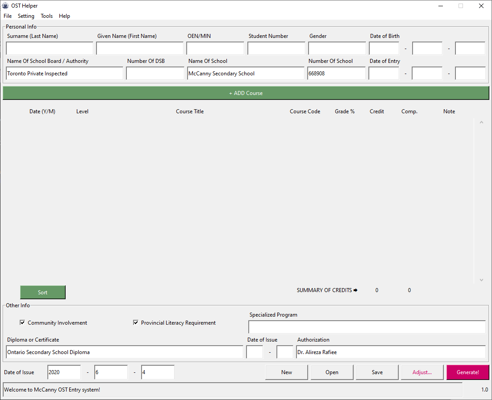
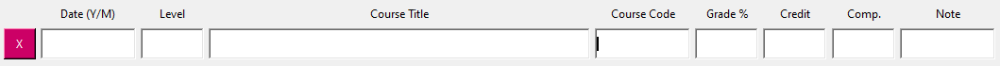
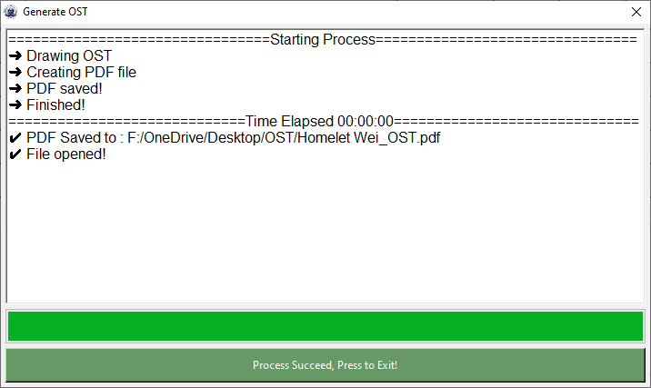
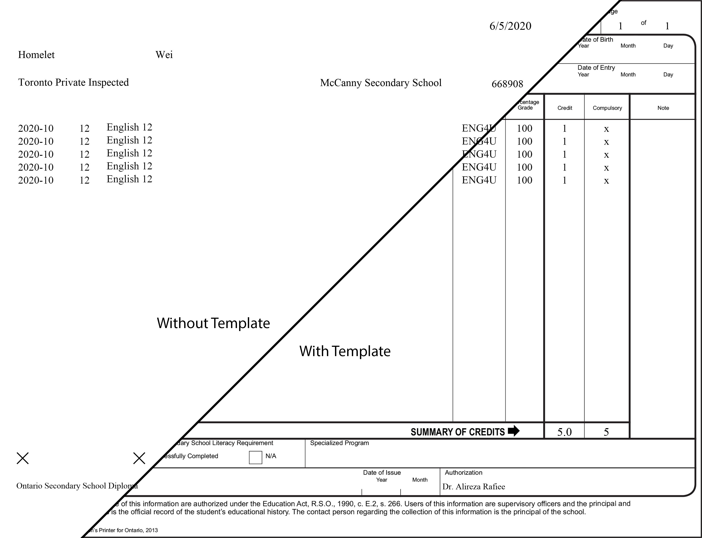
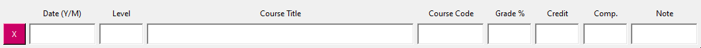
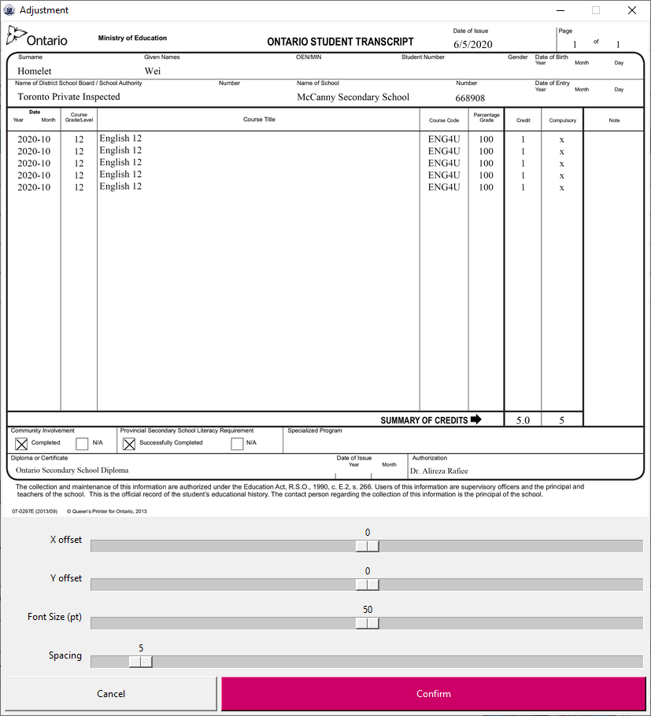
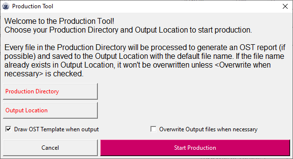

# OST Helper
OST Helper software allows users to easily create and modify Ontario Student Transcripts (OST).

## Install OST Helper

OST Helper officially supports the Windows Platform installer. Mac platform can run OST Helper through the terminal (installing packages in `requirements.txt` through pip and running the `Launcher.py` script with python3.X).

To install OST Helper, follow these steps: First, download the latest installer from https://github.com/HomeletW/OST/releases/latest. Once the download is complete, double-click on the installer file to run it. The installer will prompt you to choose a location to install the program. After the installation, navigate to the folder where the program is installed and double-click on `OST Helper.exe` to open it. Please note that a brief delay might occur before the program opens, which is normal.

## Features

- OST Helper saves transcripts in an easier-to-store and transport format: JSON files. 
- Users can export the OST to PDF with a template in the background or a transparent background for printing.
- Utilize the [Autocomplete](#Autocomplete) function to quickly add a course to the OST.
- The [Preview](#adjusting-the-ost-layout) feature lets you adjust the font size and spacing for printing the OST.
- The [Production Tool](#using-production-tool) assists in handling OST in batches.

### Update to New OST Template

_Version 2.0_ of OST Helper updated to the newest OST paper with a new "Online Learning requirements" field.

_Version 2.1_ added a feature to print the new information using the old OST paper; it manually prints out the Online Learning Requirements box. Turn on `Draw Use Old Version Paper` in the `Setting` menu when working with old version paper.

## Get Started

After the program is correctly [installed](#install-ost-helper), run the program, and you will be greeted with the main screen:

The layout of the OST Helper should be familiar. Every field corresponds with a field in OST. However, there are still some adjustments made:

1. The date of issue is moved to the bottom of the screen.
2. The Summary of Credit is automatically calculated.
    - The credit count is the sum of all `Credit` you have input. For example, if you have `0.5` and `1`, the credit count will appear as `1.5` (Note: this count ignores all NaN references).
    - The compulsory count is the number of courses that have something in `comp.` (that is, the `comp.` field is not empty).
    - _Updated_ in the newest version, you may manually override these fields.
3. A `Sort` button is under the `Date (Y/M)` fields. The function of this button is to sort the courses in ascending order by their date  (i.e. from before to after). The accepted format of date include:
    - `2000\10`
    - `2000/10`
    - `2000-10`
    - `2000.10`
    - `2000 10`

To add a course, press the `+ ADD Course` button and a course will appear at the end of the list.

There are a handful of tips and tricks about adding Courses that can help speed up the process.
- Up, Down, Left, and Right arrows move the focus in their expected direction.
- Pressing on the red `x` deletes that Course; pressing `Del` while you have focus does the same trick.
- `Enter` and `Tab` also move you to the next field.

After Finnish filling in the required field, save your work by pressing `Save` in the bottom bar or the `File` menu.

__*Note that OST Helper does not save the file automatically; it only saves when pressing `Save` and when you exit the program.*__

Now it is ready to generate the OST to PDF, but you might want to preview what the OST looks like; press the `Preview...` button in the bottom bar to look at a preview. You may adjust the spacing and font size in the adjustment window. For more about Adjustment, check out [Adjustment](#using-adjustment).

After inspecting the OST and making the adjustments, press the `Generate` button, choose your output directory, and leave the rest to OST Helper.

Note that there are two options in OST Helper in generating OST:
- With OST Template, suitable for direct use and backup.
- Without OST Template, suitable for printing on official OST paper.

Toggle output with or without the template toggle `Draw OST Template` in the `Setting` menu.

Other things to note of:
1. The default name of the OST file and the generated file is in the following format:
    - `[FIRST NAME] [LAST NAME]_[OEN]_OST`
1. Press `New` in the bottom bar or the `File` menu to start a new draft. 
1. Press `Open` in the bottom bar or the `File` menu to open an existing OST file.
1. Press' Reset' in the' File' menu to drop all info and reset everything to the factory condition.

## Autocomplete
Autocomplete assists users in quickly adding courses. The longer the user interacts with OST Helper, the more robust it becomes.

To use Autocomplete, start typing a Course Code in the `Course Code` field and press Enter Key to trigger Autocomplete. OST Helper automatically fills in course information when Autocomplete is triggered by searching the common courses library for the code entered.

_Autocomplete feature can be turned off, toggle `Autocomplete` in the `Setting` menu._

The common course codes are saved to `shared_data/common_courses.json`.

## Adjusting the OST Layout
The preview window provides several functionalities to fine-tune the layout of the OST. 
- A preview of the OST. The preview will only display the first page.
- A slider that changes the `x offset` of the prints.
- A slider that changes the `y offset` of the prints.
- A slider that changes the courses' `Font size` (in pt).
- A slider that changes the `Spacing` between the courses (the spacing can be as low as -10).

If you wish to fit more lines on a page, try decreasing the font size to the smallest acceptable size. If you need to fit even more, consider setting the spacing value to less than 0, but be aware that this may cause some overlap in the text.

## Using Production Tool
The Production tool helps generate OST to PDF in batches. 

To start the production process, gather all OST JSON files that need processing and place them in a designated folder called the "Production Directory." Next, create a separate folder for the output files, called the "Output Location." Click on the "Production Tool" option in the "Tools" menu to open it. Select the Production Directory and Output Location, then click "Start Production" to initiate the production process.

All the files in the Production Directory will undergo processing to create a pdf, provided it is possible. The processed files will then be saved to the Output Location using the default file name. However, if the default file name already exists in the Output Location, it will not be overwritten unless the option to "Overwrite when necessary" has been selected. If a PDF file already exists in the Output Location, it will not be overwritten by default. To change this behaviour, select "Overwrite Output files when necessary."